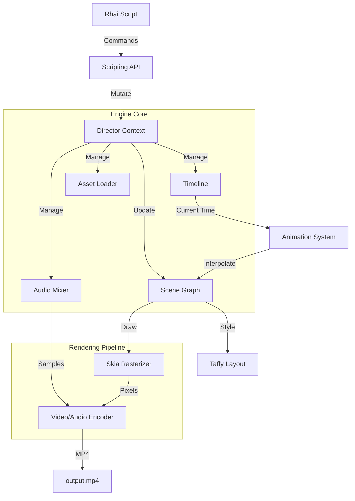

# Director Engine

**A high-performance, frame-based 2D rendering engine written in Rust.**

Designed to be embedded in Rust applications, `director-engine` combines a Scene Graph, CSS-like layout (Taffy), Skia for high-quality rasterization, and Rhai for scripting to enable programmatic video generation.

## 🌟 Core Philosophy

The engine operates on a **Frame-Based, State-Driven** model:
1.  **Scripting Layer**: A Rhai script defines the *Intent* (e.g., "Create a box", "Animate opacity").
2.  **Scene Graph**: The engine builds a tree of visual nodes managed by a central `Director`.
3.  **Layout**: Taffy computes Flexbox/Grid layouts every frame.
4.  **Rasterization**: Skia draws the computed state to a pixel buffer.
5.  **Encoding**: The frame is sent to FFmpeg (`video-rs`) for MP4 encoding.

## 🏗️ Architecture



## 📦 Installation

Add this to your `Cargo.toml`:

```toml
[dependencies]
director-engine = "1.1.1"
rhai = "1.19.0" # Recommended to match engine's version
anyhow = "1.0"
```

### System Dependencies
This crate depends on `skia-safe` and `video-rs` (ffmpeg).

*   **Skia**: Requires LLVM/Clang to build bindings.
*   **FFmpeg**: **Required** for video encoding.
    *   **Ubuntu**: `sudo apt install libavutil-dev libavformat-dev libavcodec-dev libswscale-dev`
    *   **MacOS**: `brew install ffmpeg`

## 🚀 Quick Start

### 1. Rust Embedding
Initialize the engine and run a script from your Rust application.

```rust
use director_engine::{scripting, DefaultAssetLoader, render::render_export};
use rhai::Engine;
use std::sync::Arc;
use std::path::PathBuf;

fn main() -> anyhow::Result<()> {
    // 1. Initialize Rhai Engine with Director API
    let mut engine = Engine::new();
    scripting::register_rhai_api(&mut engine, Arc::new(DefaultAssetLoader));

    // 2. Define Script
    let script = r#"
        let movie = new_director(1920, 1080, 30);
        let scene = movie.add_scene(5.0);

        scene.add_text(#{
            content: "Hello World",
            size: 100.0,
            color: "#FFFFFF"
        });

        movie
    "#;

    // 3. Compile & Execute
    let movie_handle = engine.eval::<scripting::MovieHandle>(script)?;

    // 4. Render
    println!("Rendering...");
    let mut director = movie_handle.director.lock().unwrap();
    render_export(&mut director, PathBuf::from("output.mp4"), None, None)?;
    println!("Done!");

    Ok(())
}
```

### 2. Rhai Script Example
The scripting API is designed to be intuitive and CSS-like.

```rust
let movie = new_director(1080, 1920, 30);
let scene = movie.add_scene(5.0);

// Flexbox Layout
let box = scene.add_box(#{
    width: "100%",
    height: "100%",
    justify_content: "center",
    align_items: "center",
    bg_color: "#1e1e1e"
});

// Rich Text
let text = box.add_text(#{
    content: "Director Engine",
    size: 80.0,
    color: "#ffffff",
    weight: "bold"
});

// Animation
text.animate("scale", 0.0, 1.0, 1.5, "bounce_out");

movie
```

## ✨ Features

*   **Flexbox Layout**: Powered by [Taffy](https://github.com/DioxusLabs/taffy).
*   **Rich Text**: Advanced typography with [cosmic-text](https://github.com/pop-os/cosmic-text) (gradients, mixed styles, shadows).
*   **Vector Graphics**: First-class support for SVG and Lottie animations.
*   **Animation**:
    *   Keyframe animation with easing (Linear, EaseIn, EaseOut, BounceOut).
    *   Physics-based Spring animations.
    *   SVG Path animation.
    *   Text Animator (per-glyph animation).
*   **Compositing**: Advanced masking and blend modes (Overlay, Multiply, Screen, etc.).
*   **Visual Effects**: Blur, Color Matrix (Sepia, Grayscale), and Custom Runtime Shaders (SkSL).
*   **Nested Timelines**: Create reusable `Composition` nodes with their own isolated timelines.
*   **Transitions**: Built-in scene transitions (Fade, Slide, Wipe) with ripple-edit logic.
*   **Audio**: Multi-track audio mixing with volume automation.
*   **Motion Blur**: Cinematic motion blur via sub-frame accumulation.
*   **Design System**: Integrated tokens for safe areas, spacing, and z-index.

## 📚 Documentation

*   **[Scripting Guide](SCRIPTING.md)**: A "Textbook" style guide with examples for every feature.
*   **[API Reference](API.md)**: A comprehensive "Dictionary" of all available functions and properties.

## 📂 Project Structure

*   `src/lib.rs`: Library entry point.
*   `src/director.rs`: Core engine coordinator.
*   `src/scripting.rs`: Rhai bindings and API definition.
*   `src/render.rs`: Skia rendering pipeline.
*   `src/node.rs`: Visual node implementations.
