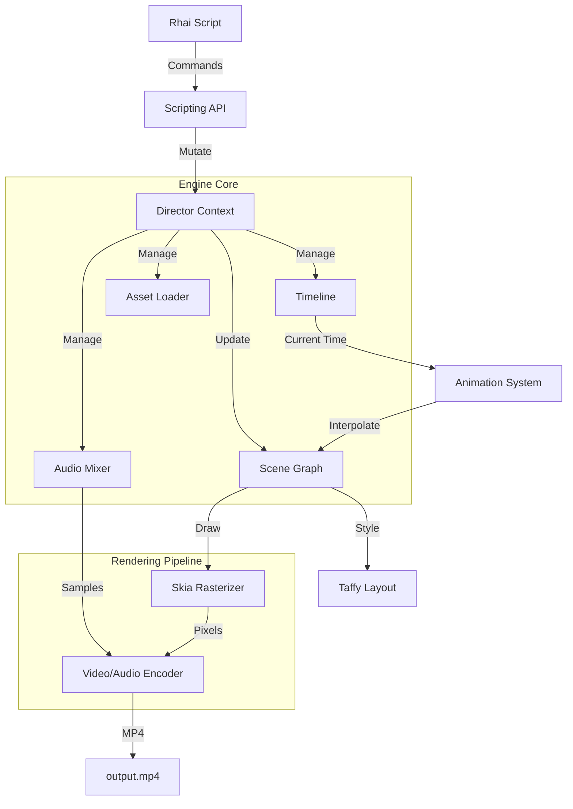

# director-engine

**A high-performance, frame-based 2D rendering engine written in Rust.**

Designed to be a backend for programmatic video generation (similar to Remotion), it combines a Scene Graph, CSS-like layout (Taffy), Skia for high-quality rasterization, and Rhai for scripting.

## 🌟 Core Philosophy

The engine operates on a **Frame-Based, State-Driven** model:
1.  **Scripting Layer**: A Rhai script defines the *Intent* (e.g., "Create a box", "Animate opacity").
2.  **Scene Graph**: The engine builds a tree of visual nodes managed by a central `Director`.
3.  **Layout**: Taffy computes Flexbox/Grid layouts every frame.
4.  **Rasterization**: Skia draws the computed state to a pixel buffer.
5.  **Encoding**: The frame is sent to FFmpeg (`video-rs`) for MP4 encoding.

## 🏗️ Architecture



## 🚀 Setup & Installation

### System Dependencies
This crate depends on `skia-safe` and `video-rs` (ffmpeg).

*   **Skia**: Requires LLVM/Clang to build bindings.
*   **FFmpeg**: **Required** for video encoding.
    *   **Ubuntu**: `sudo apt install libavutil-dev libavformat-dev libavcodec-dev libswscale-dev`
    *   **MacOS**: `brew install ffmpeg`

### Running the Demo
The project comes with a built-in demo script in `src/main.rs`.

```bash
# Run with default features (requires FFmpeg)
cargo run --release

# Run with Vulkan hardware acceleration (if supported)
cargo run --release --features vulkan
```

### Mock Mode (Development)
If you are in an environment without FFmpeg system libraries, you can run in **Mock Mode**. This verifies the logic, layout, and rendering pipeline without producing an actual MP4 file.

```bash
cargo run --no-default-features --features mock_video
```

## 📚 Documentation

*   **[Scripting Guide](SCRIPTING.md)**: A "How-To" guide with code examples for layout, animation, and effects.
*   **[API Reference](API.md)**: Comprehensive reference for all available Rhai functions and properties.

## ✨ Features

*   **Flexbox Layout**: Powered by [Taffy](https://github.com/DioxusLabs/taffy).
*   **Rich Text**: Advanced typography with [cosmic-text](https://github.com/pop-os/cosmic-text) (gradients, mixed styles).
*   **Animation**: Keyframe animation for any numeric property, plus SVG Path animation.
*   **Transitions**: Built-in scene transitions (Fade, Slide, Wipe) with ripple-edit logic.
*   **Audio**: Multi-track audio mixing with volume automation.
*   **Motion Blur**: Cinematic motion blur via sub-frame accumulation.
*   **Design System**: Integrated tokens for safe areas, spacing, and z-index.

## 📂 Project Structure

*   `src/lib.rs`: Library entry point.
*   `src/director.rs`: Core engine coordinator, Timeline logic, and Scene Graph management.
*   `src/node.rs`: Implementation of specific nodes (`BoxNode`, `TextNode`, `ImageNode`, `VideoNode`).
*   `src/element.rs`: The `Element` trait and visual primitives (Color, Gradient, TextSpan).
*   `src/layout.rs`: Integration with the Taffy layout engine.
*   `src/render.rs`: The main render loop, Skia integration, and shader effects.
*   `src/scripting.rs`: Rhai bindings and API definition.
*   `src/animation.rs`: Animation state, Keyframe logic, and Easing functions.
*   `src/audio.rs`: Audio loading, decoding (Symphonia), and mixing logic.
*   `src/tokens.rs`: Design System implementation (Safe Areas, Spacing).
*   `src/video_wrapper.rs`: Abstraction layer for `video-rs` (handling mock vs real encoding).
*   `src/main.rs`: CLI entry point and demo runner.
