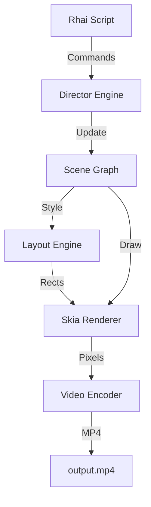

# Director Engine

**The "Director" is a high-performance, frame-based 2D rendering engine written in Rust.**

Designed to be a backend for programmatic video generation (similar to Remotion), it combines a Scene Graph, CSS-like layout (Taffy), Skia for high-quality rasterization, and Rhai for scripting.

## 🌟 Core Philosophy

The engine operates on a **Frame-Based, State-Driven** model:
1.  **Scripting Layer**: A Rhai script defines the *Intent* (e.g., "Create a box", "Animate opacity").
2.  **Scene Graph**: The engine builds a tree of visual nodes.
3.  **Layout**: Taffy computes Flexbox/Grid layouts every frame.
4.  **Rasterization**: Skia draws the computed state to a pixel buffer.
5.  **Encoding**: The frame is sent to FFmpeg (`video-rs`) for MP4 encoding.

## 🏗️ Architecture



## 🚀 Setup & Installation

### System Dependencies
Since this crate depends on `skia-safe` and `video-rs` (ffmpeg), anyone who tries to `cargo install` or build this crate will need these system dependencies installed first.

*   **Skia**: Requires LLVM/Clang to build bindings, though `skia-safe` often downloads pre-built binaries.
*   **FFmpeg**: **Required** for video encoding. The default feature set includes `video-rs`, which links against system FFmpeg libraries.
    *   **Ubuntu**: `sudo apt install libavutil-dev libavformat-dev libavcodec-dev libswscale-dev`
    *   **MacOS**: `brew install ffmpeg`

### Running the Demo
The project comes with a built-in demo script in `src/main.rs`.

```bash
cd director
cargo run --release
```

### Mock Mode (Development)
If you are in an environment without FFmpeg system libraries, you can run in **Mock Mode**. This verifies the logic, layout, and rendering pipeline without producing an actual MP4 file.

```bash
cargo run --no-default-features --features mock_video
```

## 📜 Scripting API Reference

The engine exposes a Domain Specific Language (DSL) via Rhai.

### 1. Initialization
```rust
// Create a movie (Width, Height, FPS)
let movie = new_director(1080, 1920, 30);

// Add a Scene (Duration in seconds)
let scene = movie.add_scene(5.0);
```

### 2. Elements
Elements are added to a Scene or a container Box. They support a subset of CSS-like properties.

```rust
// Add a Flexbox Container
let box = scene.add_box(#{
    bg_color: "#FFFFFF",
    // Layout props
    width: "100%",       // or 500.0, "auto"
    height: 500.0,
    flex_direction: "column", // row, column, row_reverse, column_reverse
    align_items: "center",    // center, start, end, stretch
    justify_content: "center", // center, start, end, space_between...
    padding: 20.0,
    margin: 10.0,
    flex_grow: 1.0
});

// Add Text (Uses Cosmic-Text for shaping)
let text = box.add_text(#{
    content: "Hello World"
});

// Add Image
let img = box.add_image("assets/image.png");

// Add Video
let vid = box.add_video("assets/video.mp4");
```

### 3. Animation
Any numeric property can be animated using keyframes.

```rust
// .animate(property, start_value, target_value, duration, easing)
// Easing: "linear", "ease_in", "ease_out", "bounce_out"

text.animate("size", 20.0, 100.0, 2.0, "bounce_out");
text.animate("opacity", 0.0, 1.0, 1.0, "linear");
```

### 4. Effects
Support for visual effects like Blur.

```rust
// Set blur radius (pixels)
box.set_blur(10.0);

// Animate blur
box.animate("blur", 0.0, 1.0, "linear");
```

## 📂 Project Structure

*   `src/lib.rs`: Library entry point.
*   `src/director.rs`: The core engine state (`Director`) and Scene Graph management.
*   `src/node.rs`: Implementation of specific nodes (`BoxNode`, `TextNode`, `ImageNode`, `VideoNode`).
*   `src/element.rs`: The `Element` trait defining the interface for all visual objects.
*   `src/layout.rs`: Integration with the Taffy layout engine.
*   `src/render.rs`: The main render loop and Skia integration.
*   `src/scripting.rs`: Rhai bindings and API definition.
*   `src/video_wrapper.rs`: Abstraction layer for `video-rs` (handling mock vs real implementation).
