# Director Engine Architecture

This document provides a high-level overview of the internal architecture and the frame loop execution flow of `director-engine`.

## High Level Components

*   **Director**: The central coordinator. It manages the `SceneGraph`, `Timeline`, and shared `AssetManager`.
*   **SceneGraph**: A flattened list of `SceneNode`s (ECS-lite). Nodes contain a generic `Element` (behavior) and `Transform`/`Style` data.
*   **LayoutEngine**: A wrapper around `Taffy` that computes Flexbox/Grid layouts for the scene graph.
*   **AssetManager**: Thread-safe storage for heavy resources (Images, Fonts, Shaders).
*   **Renderer**: Recursive Skia drawing logic that traverses the computed layout and draws to a Surface/Canvas.
*   **VideoWrapper**: Encapsulates `video-rs` (ffmpeg) for encoding frames to MP4.

## Frame Execution Loop

The following sequence diagram illustrates the lifecycle of a single frame render.

```mermaid
sequenceDiagram
    participant User as Rust/Rhai Script
    participant Director
    participant Timeline
    participant Scene as SceneGraph
    participant Anim as Animation System
    participant Layout as LayoutEngine (Taffy)
    participant Render as Skia Renderer
    participant Encoder as FFmpeg Encoder

    User->>Director: new_director()
    User->>Director: add_scene() / add_node()
    User->>Director: render_export(path)

    loop Every Frame (e.g., 0.0s to 5.0s)
        Director->>Director: update(time)

        rect rgb(30, 30, 30)
            note right of Director: 1. State Update Phase
            Director->>Timeline: Get Active Scene(s)
            Director->>Scene: Traverse Active Nodes

            loop For Each Node
                Scene->>Scene: Calculate Local Time
                Scene->>Anim: Update Animated Properties
                Anim-->>Scene: New Values (Opacity, Transform, Uniforms)
                Scene->>Scene: Element::update(local_time)
            end
        end

        rect rgb(40, 40, 40)
            note right of Director: 2. Layout Phase
            Director->>Layout: compute_layout(width, height)
            Layout->>Scene: Measure Intrinsic Sizes (Text/Image)
            Layout->>Layout: Compute Taffy Tree
            Layout-->>Director: Final Layout Rects

            Director->>Scene: run_post_layout()
            Scene->>Scene: Element::post_layout() (e.g., Auto-Shrink Text)
        end

        rect rgb(50, 50, 50)
            note right of Director: 3. Render Phase
            Director->>Render: render_recursive(root_node)

            loop Recursively Draw Tree
                Render->>Scene: Get Transform/Opacity
                Render->>Render: Canvas::save() / concat()

                alt Has Effects (Blur/Shader)?
                    Render->>Render: save_layer(ImageFilter)
                end

                Render->>Scene: Element::render(Canvas)

                alt Is CompositionNode?
                   Scene->>Director: Nested Director::render()
                else Is TextNode?
                   Scene->>Scene: Shape & Draw Glyphs
                end

                Render->>Render: Canvas::restore()
            end
        end

        rect rgb(60, 60, 60)
            note right of Director: 4. Encode Phase
            Director->>Director: mix_audio()
            Director->>Encoder: Send Audio Samples
            Director->>Encoder: Send Video Frame (Pixels)
        end
    end

    Encoder-->>User: output.mp4
```

## Data Flow

1.  **Scripting**: Rhai scripts mutate the `SceneGraph` via `NodeHandle`s.
2.  **Update**: `Animated<T>` structs interpolate values based on the current time and keyframes/springs.
3.  **Layout**: `Taffy` computes the geometry.
4.  **Render**: `Skia` rasterizes the geometry using the updated state.
